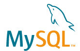

# Proyecto final Bootcamp en **HACK A BOSS**

<br />
<p align="center">
  <a href="https://github.com/othneildrew/Best-README-Template">
    
  </a>

  <h3 align="center">Airboss</h3>
  <h4 align="center">Un mundo disponible para ti</h4>
</p>
<br />

## Acerca del proyecto

![Product Name Screen Shot][product-screenshot]

Airboss es un portal de reserva de vuelos que consulta en tiempo real la disponibilidad de asientos en vuelos de todo el mundo.

### Tecnologías utilizadas

-   **BACKEND** - Node.js 
-   **FRONTEND** - React.js 
-   **BASE DE DATOS** - MySQL 

## Comenzando

### Instalación

1. Clona el repositorio
    ```sh
    git clone https://github.com/rmanueco/airboss_HAB.git
    ```
2. Instala los paquetes NPM para el servidor
    ```sh
    cd servidor
    npm install
    ```
3. Instala los paquetes NPM para el cliente
    ```sh
    cd cliente
    npm install
    ```
4. En el .env del servidor necesitarás generar las siguientes credenciales:

    SENDGRID_API_KEY= <a href= "https://sendgrid.com/">Click aquí para generar</a> <br/>
    SENDGRID_FROM= **Correo desde el que envías el mail** <br/>
    CLIENT_ID= <a href= "https://developers.amadeus.com/">Click aquí para generar</a> <br/>
    CLIENT_SECRET=<a href= "https://developers.amadeus.com/">Click aquí para generar</a> <br/>
    GOOGLE_CLIENT_ID= <a href= "https://developers.google.com/identity/protocols/oauth2">Click aquí para generar</a> <br/>
    GOOGLE_SECRET_ID= <a href= "https://developers.google.com/identity/protocols/oauth2">Click aquí para generar</a> <br/>

5. En el .env del servidor necesitarás generar las siguientes credenciales:

    REACT_APP_ID_GOOGLE= Recogido en el paso 5 </br>
    REACT_APP_ID_FB= Recogido en el paso 5 </br>
    REACT_APP_PAYPAL_EMAIL= <a href= "https://developer.paypal.com/developer/accounts/">Click aquí para generar</a> <br/>
    REACT_APP_PAYPAL_PASSWORD= <a href= "https://developer.paypal.com/developer/accounts/">Click aquí para generar</a> <br/>
    REACT_APP_PAYPAL_CLIENTID=<a href= "https://developer.paypal.com/developer/accounts/">Click aquí para generar</a> <br/>

## Uso

Si quieres realizar un pago mediante Paypal usando tarjeta puedes introducir una de estas dos para validar con éxito, la fecha de caducidad debe ser posterior a la actual:

-   **MASTERCARD** 2223000048400011
-   **VISA** 4012888888881881

![Product Name Screen Shot][payment-screenshot]

## Licencia

Distribuido bajo licencia del MIT.

<!-- Recursos para el Readme-->

[product-screenshot]: images/home.png
[payment-screenshot]: images/payment.png
